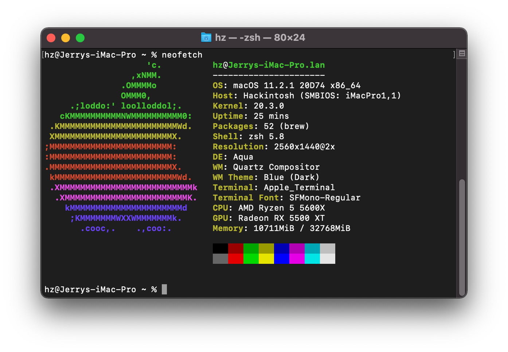
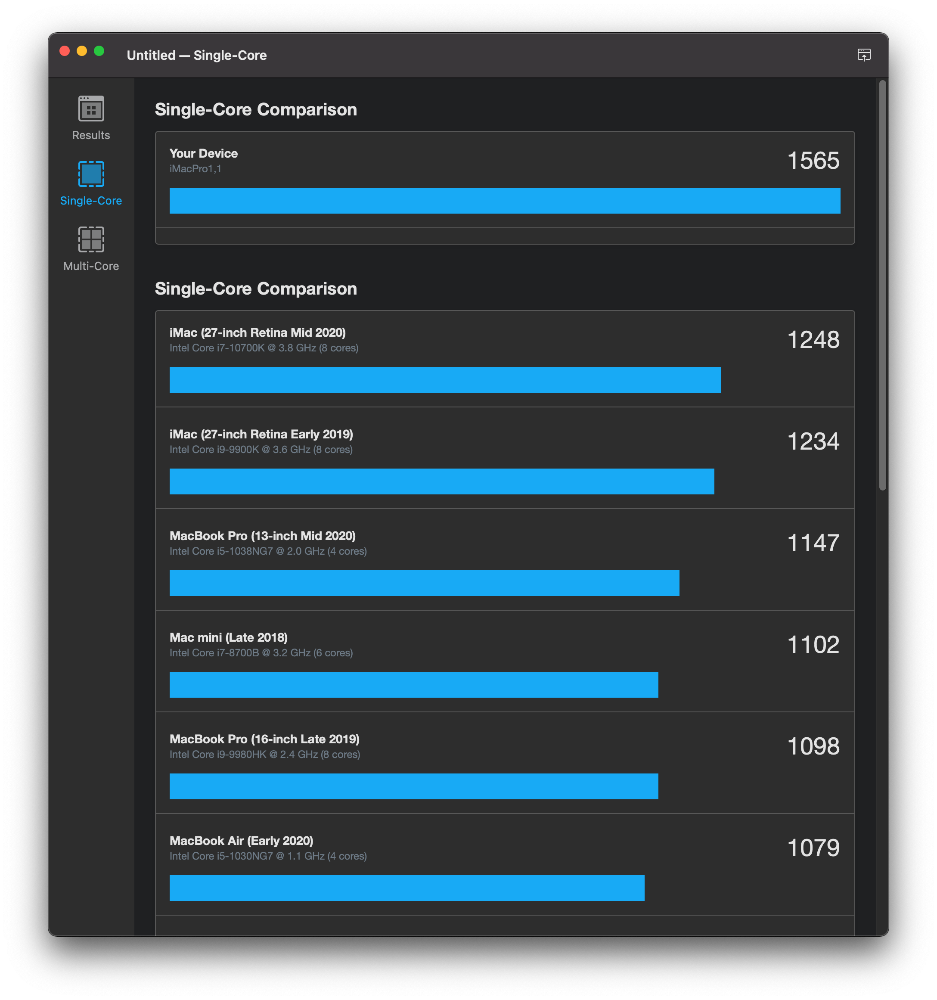
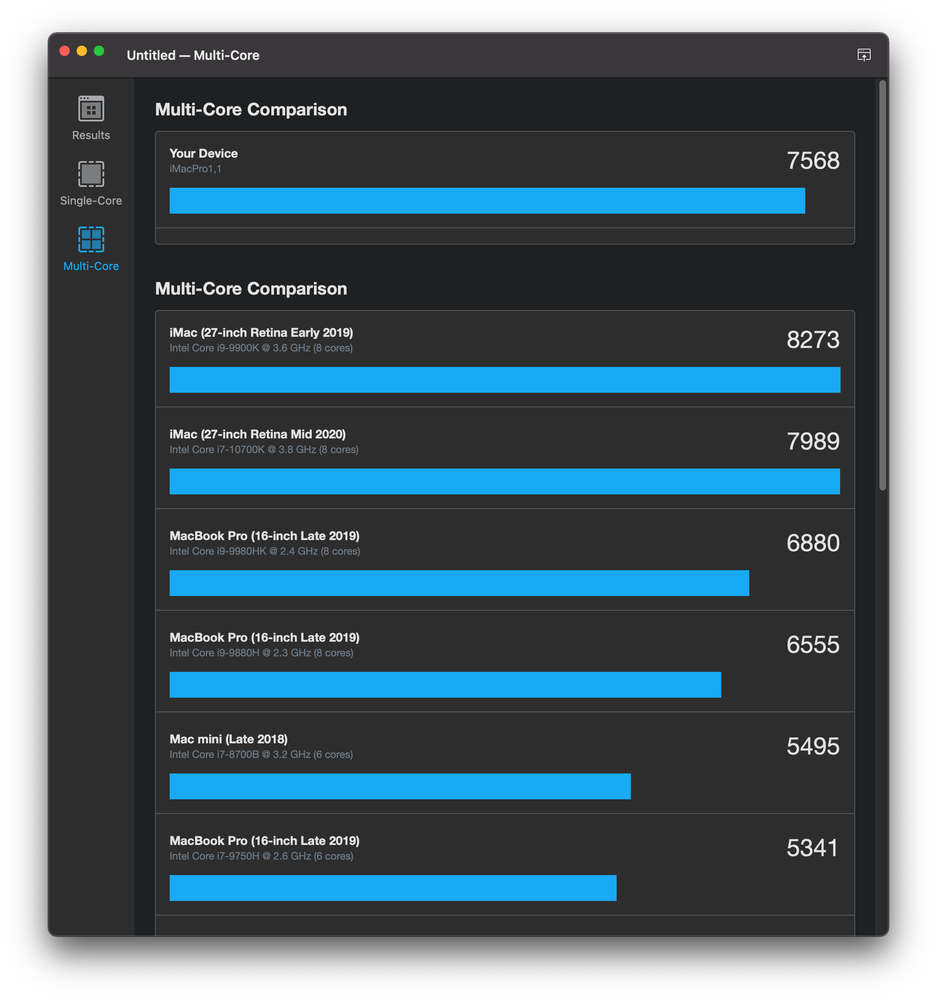

# AMD Ryzen Hackintosh - Opencore EFI for ASUS ROG STRIX B550-A GAMING

## Specification
| **Component** | **Model** |
| ------------- | --------- |
| CPU | AMD Ryzen 5 5600X @ 3.7GHz |
| Motherboard | ASUS ROG STRIX B550-A GAMING |
| RAM | 32GB (2 x 16GB) US CORSAIR Vengeance DDR4-3200 |
| GPU | Sapphire Pluse RX 5500 XT 8G |
| Ethernet | Intel® I225-V 2.5Gb |
| OS Disk (SATA) | Samsung SSD 860 EVO 1TB |

**macOS version**: 11.2.3 (20D91)  

**OpenCore version**: 0.6.7

**SMBIOS**:  iMacPro1,1

## Working
- Everything !

## Not working
 - None (No Wifi, No trouble)

## How to use
  1. Create directory "EFI" in your EFI partition (e.g. pendrive or hard drive)
  2. Clone this repo and paste directiories "BOOT" and "OC" onto created directory
  3. Download [**GenSMBIOS**](https://github.com/corpnewt/GenSMBIOS) to generate unique SMBIOS information. Run it and select **Generate SMBIOS**, as model select **iMacPro1,1**.
  4. Open config.plist with [**ProperTree**](https://github.com/corpnewt/ProperTree) and go to PlatformInfo > Generic. Set MLB (Board Serial), SystemSerialNumber (Serial) and SystemUUID (SmUUID) to generated values.
  5. Boot it!  

## Disclaimer

This documentation is published for the sole purpose of learning and tech enthusiasm and with no guarantees of any kind, I’m not responsible of any harm of any kind or loss of data that may occur.
